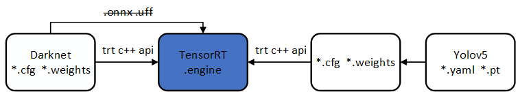

**本项目工程属于tensorRT yolov3/v4/v5 C++量化版本！**
## OverView
本工程含有2个项目，一个用于dll_detector产生dll或者so库文件，另一个为测试库文件的项目,yolov3/v4需要事先准备cfg,weights文件， [yolov5](https://github.com/ultralytics/yolov5 )需要事先准备yolov5s.yaml和yolov5s.pt文件。C++代码组织非常好，可以学习参考，另外关于tensorRT的量化过程也不错。此库非常适合windows10,ubuntu,嵌入式jetson环境部署。<br>

## TensorRT 量化流程
 量化工作原理为：先判断是否有校订table文件存在，有的话直接读取，没有就对data/目录下的图像进行calibrate生成table，先调用函数readCalibrationCache,然后getBatch,最后writeCalibrationCache，getBatch()在校验过程中
 调用多次，其他函数调用一次。所有模型文件都转换为cfg,weights,解析是使用tensorRT C++ 自定义的API。
 
 
## 更新记录
2020.9.27记录：tensorRT量化进度，审阅代码到calibrator流程，是定义Int8EntropyCalibrator 继承tensorRT库下的 public nvinfer1::IInt8EntropyCalibrator，重写calibrator类.明天需要完成自己的球员网球检测器在量化后的表现<br>
2020.9.28记录：量化了网球球员检测模型，速度10ms一帧，320×320，速度并未提高？校准表是中间生成？<br>
2020.10.9 记录：弄清楚量化接口的调用过程，以便于部署其他模型的推理量化。在PC上测评tensorRT性能结果见[此项目](https://github.com/cuixing158/yolov3-yolov4) <br>
2020.10.10记录：项目中使用engine推理图像大小是在cfg文件中定义的width,height进行的，而非实际输入图像大小。暂时终止此项目，改用onnxruntime进行推理，因为onnxruntime已经集成了tensorRT推理引擎。<br>



- [x] yolov5s , yolov5m , yolov5l , yolov5x [tutorial](yolov5_tutorial.md)
- [x] yolov4 , yolov4-tiny
- [x] yolov3 , yolov3-tiny

## Features

- [x] inequal net width and height
- [x] batch inference
- [x] support FP32,FP16,INT8
- [ ] daynamic input size


## PLATFORM & PERFORMENCE

- [x] windows 10
- [x] ubuntu 18.04
- [x] L4T (Jetson platform)

|     model      |             gpu              | precision | detect time(with pre and post process) |
| :------------: | :--------------------------: | :-------: | :------------------------------------: |
| yolov3-416x416 |      jetson nano (15w)       |   FP16    |                 250ms                  |
| yolov3-416x416 | jetson xavier nx (15w 6core) |   FP32    |                 120ms                  |
| yolov3-416x416 | jetson xavier nx (15w 6core) |   FP16    |                  45ms                  |
| yolov3-416x416 | jetson xavier nx (15w 6core) |   INT8    |                  35ms                  |

## WRAPPER

Prepare the pretrained __.weights__ and __.cfg__ model. 

```c++
Detector detector;
Config config;

std::vector<BatchResult> res;
detector.detect(vec_image, res)
```


### windows10
- cuda环境dependency：tensorRT,cuda,cudnn版本要对应，TensorRT6.0.1.5+cuda10.1+cudnn7.6.4.38 或者 TensorRT 7.1.3.4 +cuda 11.0 + cudnn 8.0 
- 软件环境dependency : opencv4 , vs2015或其他版本
- build:
  
    open MSVC _sln/sln.sln_ file 
    - dll project : the trt yolo detector dll
    - demo project : test of the dll

### ubuntu & L4T (jetson)

The project generate the __libdetector.so__ lib, and the sample code.
**_If you want to use the libdetector.so lib in your own project,this [cmake file](https://github.com/enazoe/yolo-tensorrt/blob/master/scripts/CMakeLists.txt) perhaps could help you ._**


```bash
git clone https://github.com/enazoe/yolo-tensorrt.git
cd yolo-tensorrt/
mkdir build
cd build/
cmake ..
make
./yolo-trt
```
## API

```c++
struct Config
{
	std::string file_model_cfg = "configs/yolov4.cfg";

	std::string file_model_weights = "configs/yolov4.weights";

	float detect_thresh = 0.9;

	ModelType net_type = YOLOV4;

	Precision inference_precison = INT8;
	
	int gpu_id = 0;

	std::string calibration_image_list_file_txt = "configs/calibration_images.txt";

	int n_max_batch = 4;	
};

class API Detector
{
public:
	explicit Detector();
	~Detector();

	void init(const Config &config);

	void detect(const std::vector<cv::Mat> &mat_image,std::vector<BatchResult> &vec_batch_result);

private:
	Detector(const Detector &);
	const Detector &operator =(const Detector &);
	class Impl;
	Impl *_impl;
};
```

## REFERENCE

- https://github.com/enazoe/yolo-tensorrt
- https://github.com/wang-xinyu/tensorrtx/tree/master/yolov4
- https://github.com/mj8ac/trt-yolo-app_win64
- https://github.com/NVIDIA-AI-IOT/deepstream_reference_apps


